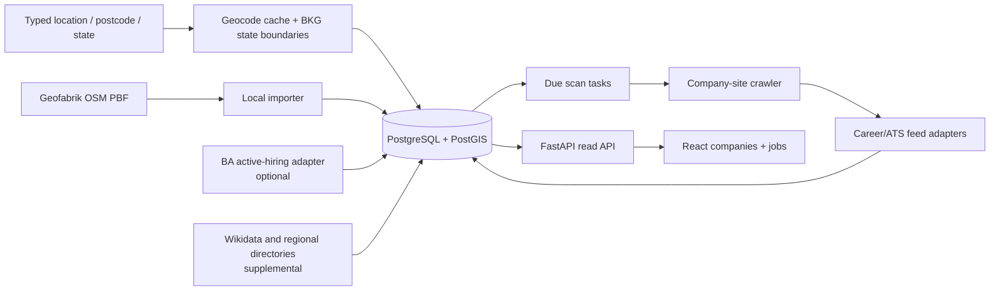

# Implementation plan: German employer and job-feed discovery

**Decision date:** 2026-10-05. **Status:** implementation in progress. The read-only company/job UI, full 2,251-record Karlsruhe OSM snapshot, 1,606-seed career crawl, location resolver, PostGIS radius queries, scheduled feed and company-discovery workers, Compose stack, and GHCR build workflow are in the repository. The latest offline HTML reprocessing reports 669 career/page/provider outcomes and 1,632 accepted jobs from the original 1,606 website seeds; the [domain/HTML follow-up](../reports/full-crawl-domain-and-html-followup.md) records that run and five additional jobs from two supplemental sites. Karlsruhe now has a conservative Wikidata-backed missing-domain enrichment pass; nationwide company import and location-prioritized discovery remain future slices. Source evaluations are in the [location experiments](../reports/location-source-experiments.md), [career POC](../reports/career-discovery-poc.md), and [career improvements](../reports/career-discovery-improvements.md).

This document describes the target product and the remaining implementation path. The current interface resolves a German city or postcode, offers a radius, and shows companies from the Karlsruhe seed plus jobs with a matching work location or an explicit remote marker. It does not yet import companies for newly selected locations.

## Product boundary and search semantics

The first application lets a user enter a German city, town, postcode, or selected map point and a radius in kilometres. A state search is a second mode. The result set contains **organizations with a documented establishment point inside that area**. A company that merely advertises a job in the area is not automatically a local company. Each result shows the source and precision of its location. City-centroid and state-only records can be shown as separately labelled leads, but cannot pass a strict street-level radius filter.

The first UI has two read-only views: companies (name, homepage/domain, local establishment, distance, career/board link and verification status, parsed job count, last check) and jobs (title, employer/domain, work location(s), remote/hybrid status when stated, employment type, publication date, first/last seen, source/apply URLs, and extracted description/metadata). The **company view** matches employer establishments to the radius. The **jobs view** independently includes postings with at least one work location inside the radius, plus all explicitly remote postings; it may include a job from an employer whose office is outside the company radius. Work location and employer location are shown separately. State selection uses actual state boundaries, not a state's capital as a surrogate. Search parameters and pagination live in the URL so results are shareable.

There is no account, CV upload, ranking, application automation, or notification in this release. Retaining normalized job text, structured metadata, source provenance, and stable IDs makes later saved jobs and CV-based matching possible without committing to a matching algorithm or storing personal data now.

## Technology and deployment choices

| Part | Choice | Reason |
|---|---|---|
| Crawler, worker, API | Python, retaining `hiring_scraper`; add [FastAPI](https://fastapi.tiangolo.com/features/) | The tested parsers and fixtures are already Python. FastAPI gives typed HTTP contracts and generated OpenAPI, so a rewrite in another language would add risk without improving discovery. Use a separate process for network crawling, not API request handlers. |
| Persistence and radius search | PostgreSQL + [PostGIS](https://postgis.net/documentation/tips/st-dwithin/), SQLAlchemy 2 and Alembic migrations | Indexed `ST_DWithin` on WGS84 geography gives distances in metres and works across city/state borders. PostgreSQL also stores normalized relational identities and JSONB source payloads. |
| Frontend | React + TypeScript + [Vite](https://vite.dev/guide/) | A small client-side read-only application can be built into [static assets](https://vite.dev/guide/build), while a typed API keeps room for richer tracking/filtering later. No server-side rendering is needed for an internal discovery UI. |
| Scheduling | A Python worker using a PostgreSQL due-task table | One operational data store is enough initially. Workers atomically claim due rows with [`FOR UPDATE SKIP LOCKED`](https://www.postgresql.org/docs/current/sql-select.html), leases, and retry timestamps; no Redis/broker until measured throughput warrants it. |
| Delivery | Docker Compose on a host; GitHub Actions builds API/worker and web images to [GHCR](https://docs.github.com/en/actions/tutorials/publish-packages/publish-docker-images) | Builds are tested and published by GitHub runners. The target host pulls pinned image digests, runs a one-shot migration, then starts services. [Compose health dependencies](https://docs.docker.com/compose/how-tos/startup-order) protect startup order. Large map extracts live in a persistent import volume, never in images. |

Use a single Python application image with commands for `api`, `worker`, `discovery-worker`, and one static web image. Compose services are `db` (PostGIS and persistent volume), `migrate` (one-shot), `api`, the feed `worker`, the company `discovery-worker`, and `web` (static server/reverse proxy). The importer is a one-shot command or profile, not a permanently running container. Pin dependency versions and image digests at implementation time; avoid silently upgrading the database major version.

## Source pipeline and ranking

1. **Primary local candidates: OSM regional extracts.** Import German state PBFs from [Geofabrik](https://www.geofabrik.de/data/download.html), first Baden-Württemberg and then all states. Start with the tested named `office`, `craft`, and `industrial` objects; evaluate additional employer-like `shop` and `amenity` categories against a labelled sample so retail, health, and education employers are not silently omitted. Keep exact OSM IDs, tags, websites, address, geometry, and import version. Store usable point/centroid precision separately. A mapped object is a candidate establishment, not proof of a legal company. Download/extract off the request path and upsert by `(source, object type, object ID)`. Prefer weekly refreshes at first. The Karlsruhe experiments found 2,251 bounded 15 km objects and 1,606 with website tags, whereas public Overpass returned HTTP 504 on a state query; recurring national queries should therefore use local extracts. [OSM attribution and ODbL](https://www.openstreetmap.org/copyright) must follow the data into the UI and exports.
2. **Location resolution.** Resolve a submitted place query and cache its candidates; show disambiguation for duplicate place names. The public [Nominatim policy](https://operations.osmfoundation.org/policies/nominatim/) permits light, user-triggered lookups under its conditions: identify the application, cap aggregate traffic at one request/second, cache results, and do **not** use it for keystroke autocomplete or bulk geocoding. Keep the provider configurable and switch to a self-hosted or contracted geocoder before public/high-volume use. Use [BKG VG250](https://gdz.bkg.bund.de/index.php/default/wfs-verwaltungsgebiete-1-250-000-stand-01-01-wfs-vg250.html) polygons for state membership. `ST_DWithin(organization_location.point::geography, search_point::geography, radius_m)` with a GiST index implements circles; polygon containment implements state mode. A circle is allowed to cross state borders. A postcode query resolves to an explicitly labelled point/area representative, not an assertion that the entire postcode polygon lies in the radius.
3. **Additional leads, kept behind source adapters.** Wikidata may add names and homepages absent from OSM, but a headquarters property that resolves only to a city centroid does not satisfy a precise-radius match. Regional employer directories, such as the tested KIT directory, can contribute local candidates with provenance and their own parsers. The observed Arbeitsagentur jobs endpoint supplies an active-hiring signal and employer-name leads, but lacks a verified stable public contract in this POC: ship it as an opt-in adapter whose failure cannot stop core discovery, and verify access/terms before continuous use. TED, GLEIF, MaStR, CORDIS, and paid Places/search APIs stay outside the first production path until a labelled sample proves incremental verified employers or domains per cost. Do not promote tender winners or job-location-only records to local establishments.
4. **Organization resolution and domain evidence.** Normalize URLs to exact host plus registrable domain; keep every raw URL and source record. Group branches under an organization only when name/address/domain evidence supports it; one shared domain alone is insufficient for an automatic legal-entity merge. A homepage from OSM is a **source-reported domain**, then the crawler verifies redirects and ownership. For website-less Karlsruhe candidates, a supplemental resolver follows OSM `wikidata`, `brand:wikidata`, and `operator:wikidata` identifiers to Wikidata's official website property. Direct entity links are strongest; brand/operator claims need name/domain overlap, existing OSM domains are not duplicated, deprecated claims are rejected, and country-specific non-German brand sites are not assigned to Karlsruhe records. It added 13 domains among 645 candidates without an OSM website tag, alongside one earlier manual match; 631 records still lack a known homepage. Other candidates remain unknown pending better evidence. Keep suggested and verified identities separate, with manual review for ambiguous merges. See the [domain/HTML follow-up](../reports/full-crawl-domain-and-html-followup.md).
5. **Career discovery from the employer side.** Run the existing bounded, robots-aware homepage/sitemap crawler against verified domains. Save employer career pages, hosted ATS boards, and machine-readable feed URLs as different endpoints, with the linking page and last check as evidence. A vendor-looking URL without an employer-site link remains a lead. A focused second pass may use a documented search API for unresolved companies; verify the result against the employer site or equivalent ownership evidence. Keep the default six-page crawl budget; the tested twelve-page budget did not improve outcomes. The Karlsruhe pilot now schedules this separately from the API, leases due companies, records each run, imports parsed feeds/jobs, and retries failures. Website enrichment is provenance-tagged and queued for an initial worker scan; company crawls default to every 30 days and are bounded to six pages, three link levels and 24 requests per company.
6. **Job extraction.** Convert the existing Greenhouse, Lever, Personio, Ashby, and linked Schema.org DataFeed parsers into persisted adapters. The POC parsed eight distinct feeds and 89 postings across its selected corpus; this proves parser feasibility, not population coverage. For ordinary employer HTML, parse JSON-LD `JobPosting`, safe embedded job arrays, linked job cards, and detail pages without running page scripts; retain employer metadata, normalize location/title details, and merge listing/detail copies. External HTML rows require a verified link path from the employer and matching per-job employer evidence; unmatched portal rows are excluded. Hidden modal text is ignored. Record Workday, SuccessFactors, Softgarden, Recruitee, Helix, Onlyfy, and SmartRecruiters as `detected_unsupported` until their own public-access and parser tests pass. A valid empty feed is `complete_empty`; a blocked, timed-out, or malformed feed is `incomplete`, never zero jobs. Preserve provider-specific raw metadata alongside normalized fields, with provenance per field where sources disagree. Never treat a challenge/login as a reason to bypass access controls.

For national rollout, import the OSM index in bulk and prioritize stale domains from user-searched regions. A location search should return matching company candidates immediately from the local index and queue due domains; the UI can show `queued` or `not yet scanned` while the worker runs. The current Karlsruhe pilot instead schedules all website-tagged candidates by due time; 645 of the 2,251 OSM candidates have no OSM website tag. The supplemental resolver has supplied homepage evidence for 14 of those records so far, leaving 631 without a known domain. Cap daily requests and do not promise that every German organization has been crawled. No external network crawl runs inside the search API request.

## Data contracts

Core records and invariants:

| Record | Required fields / rule |
|---|---|
| `organization` | Stable internal ID, display name, category, resolution confidence. “Company” is the UI label; the model can also represent other hiring organizations. |
| `organization_location` | Source-backed coordinate/address, `role` (HQ/branch/facility), `precision` (site point/feature centroid/city/state), state code; spatial index. An organization may have many establishments. |
| `source_record` and `organization_domain` | Source ID, original payload/hash, observation time, source-reported/verified status, exact host and registrable domain. Do not erase evidence during deduplication. |
| `career_endpoint` | Employer career URL, ATS board URL, or job-feed URL; provider/tenant, verification evidence, access/parser status, next scan time and last successful scan. |
| `job` and `job_location` | Unique `(feed ID, provider job ID)` when available, canonical-URL fallback; title, description text/HTML, work arrangement, type, salary with currency/period when stated, posted date, apply URL, raw metadata, `first_seen_at`, `last_seen_at`, `closed_at`, content hash. Multiple job locations remain separate and carry coordinates plus precision. Area job search matches any in-radius work location or an explicitly remote arrangement. Unknown fields are null, not guessed. |
| `scan_task` and `scan_run` | Task kind, due time, lease/attempts, HTTP status/error, completeness, item count, duration, request metadata. A feed scan is committed atomically or remains incomplete. |

Do not mark a job closed on one failed or partial scan. Mark it inactive only after at least two consecutive **complete** scans where its ID is absent and a configurable grace period (initially seven days); reappearance reopens the same job. New jobs are those whose stable identity was first observed in a completed scan. Preserve a compact job-change event or version record for later tracking. Use conditional GET (ETag/Last-Modified) when supported; `304` means unchanged and must not close jobs. Queue leases recover worker crashes. Apply per-origin pacing, capped concurrency, exponential backoff and `Retry-After` for 429/5xx, redirect/robots checks, and an explicit scan budget.

Treat every source-supplied URL as untrusted input: allow only HTTP(S), resolve and recheck each redirect destination, block private/loopback/link-local and cloud-metadata addresses, and bound response bytes, redirects, and time. Keep the worker's database credentials and any source API keys out of images. The deployment runbook must cover database backups, restore rehearsal, source-refresh failures, scan lag, and migration rollback strategy.

Read-only API, versioned from the start:

| Endpoint | Purpose |
|---|---|
| `POST /api/v1/locations/resolve` | Submitted, cached German place/postcode candidates with coordinates, type, and precision. No public-service autocomplete. |
| `GET /api/v1/companies?lat=&lon=&radius_km=&...` or `?state=...` | Paginated companies matching establishment locations; distance, domain, career/feed status, active job count, provenance. |
| `GET /api/v1/companies/{id}` | Locations, domains, evidence, endpoints, and scan timestamps. |
| `GET /api/v1/jobs?lat=&lon=&radius_km=&...` and `GET /api/v1/jobs/{id}` | Paginated jobs whose work location matches the area or are explicitly remote, regardless of employer office distance; optional `company_id` narrows further. |
| `GET /health/ready` | Database/migration readiness for Compose. |

Enforce bounded radius/page size and stable sort order. The UI has search and radius/state controls, a company table, a job table, and company/job detail views. Show `verified feed`, `career page only`, `provider detected, unsupported`, `blocked`, and `unresolved` as distinct statuses; show freshness and source links. Provide loading, empty, partial-error, and stale-data states. The API remains read-only to browsers; import and scan commands are operational controls, not public mutation endpoints.

## Ordered implementation slices and acceptance checks

| Slice | Build | Done when |
|---|---|---|
| 1. Vertical UI slice | **Implemented; fresh local Docker/PostGIS startup, repeat fixture import, API and production web smoke verified on 2026-10-07.** Database schema/migrations, FastAPI read endpoints, React/TypeScript UI, Compose/Dockerfiles, GHCR workflow, and a checked-in Karlsruhe fixture are present. | Manual PostGIS smoke returned 16 in-area jobs and 6 remote jobs from the sample. Job search is independent of employer radius; frontend production build succeeds. Fresh-volume Compose startup and repeated fixture import passed in the [container verification](container-ci-verification.md). |
| 2. Geographic discovery | Build streaming PBF import and OSM tag normalization; add cached geocoder, state polygons, radius/state queries, and provenance. | Karlsruhe 5/15 km regression counts are explained against the dated sample; a second city and a cross-border circle return only precise in-radius establishment points; rerunning an extract updates instead of duplicating OSM IDs. Full Germany data is an operational import, not a CI fixture. |
| 3. Career and jobs | **Karlsruhe slice implemented and full candidate set crawled.** The 30-day leased discovery worker stores run evidence and verified HTML/ATS feeds/jobs; the 6-hour feed scanner persists updates and protects against partial-read closures. Location campaigns now claim up to four company checks at a time by default, with same-origin pacing preserved and SQLite result writes serialized. A live preview smoke crawled four distinct companies concurrently in 11.8 seconds and found seven jobs with no failed tasks; this proves the concurrent path works, but is not a controlled speed comparison or a PostGIS run. A fresh SQLite migration and two repeated imports were stable at 2,251 companies, 186 feeds and 1,678 jobs. The [full crawl report](../reports/karlsruhe-osm-full-discovery.md) records source yield and false-positive filtering. National location-prioritized discovery, more ATS integrations, and a scan-inspection UI remain. | Exercise the repeated worker lifecycle on Docker/PostGIS; verify new, unchanged, incomplete, valid-empty, and removed-job cases; add a region search that queues due employer-page work without blocking the API. |
| 4. Release path | **Local container CI verified; hosted Actions/GHCR publication and the live worker restart lifecycle remain outstanding.** Compose services, health checks, migration job, and GitHub Actions image build/publish workflow are present. The full Docker run passed 348 regression tests, frontend checks/build, both production image builds and a fresh PostgreSQL/PostGIS application smoke; see the [verification record](container-ci-verification.md). | CI builds both images; a fresh Compose volume migrates, imports the fixture, serves the UI, runs both workers, and restarts without losing data. Images are deployed by digest. |
| 5. Coverage tuning | Label a stratified sample across Karlsruhe, another state/city, and sectors, then trial supplemental source adapters and search-assisted career discovery. | Report verified employer/domain, career-page, parsed-feed, and active-job yield **by source**, plus crawl cost/block rate and unresolved causes. Promote an adapter only if it adds verified coverage with acceptable access conditions. |

Initial scan defaults to tune from observations: feed every six hours, employer career discovery every 30 days, source extract weekly, and low-priority unresolved leads less often. Jitter due times and limit requests per origin; make every interval configurable. CI uses small captured/licensed fixtures and mocked HTTP. Live smoke tests are opt-in and record date, source URLs/statuses, and the exact sample; they are not assertions that job counts stay fixed.

## Later extension points

Saved searches, job bookmarks, and CV matching belong in a later authenticated user domain. The present API and `job` schema expose the normalized text and metadata such matching needs; add separate user-owned profile/CV and match-score tables only when the privacy and ranking behavior are specified. Keep source ingestion, job identity, and company-location semantics independent of that feature. A higher-throughput broker, browser-rendered adapters, or paid place/search APIs should be introduced only after the pilot measures a concrete gap that they close.
